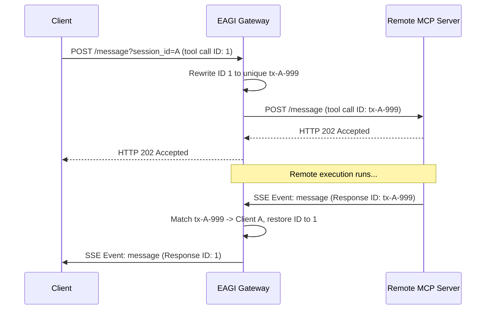

While Local Mode is excellent for development, production workloads often require routing requests to remote microservices or external MCP servers. The EAGI Go Gateway supports **Remote Mode** out of the box using configuration-driven HTTP/SSE routing.

---

## 1. Configure Remote Domains

Create a `gateway.config.json` file in your workspace working directory. Register your remote domains and their corresponding SSE endpoints:

```json
{
  "remoteDomains": {
    "billing": "http://billing-service.internal/sse",
    "crm": "http://crm-service.internal/sse"
  }
}
```

When the gateway starts, it reads this file, bypasses local process spawning for these domains, and connects directly as a client to the remote servers.

---

## 2. Dynamic Capabilities Discovery

For every configured remote domain, the Go Gateway performs an **asynchronous handshake**:

1.  **Connection**: Opens a background HTTP GET connection to the remote SSE endpoint (e.g. `http://billing-service.internal/sse`).
2.  **Endpoint Resolution**: Listens for the remote server's `event: endpoint` payload. It resolves the POST endpoint URL (e.g. `http://billing-service.internal/message?session_id=...`).
3.  **Tool Discovery**: Sends an HTTP POST `tools/list` request to the resolved POST endpoint. When the response arrives over the SSE connection, the gateway parses the list of tools and dynamically registers them in the gateway router.

---

## 3. Proxying Execution

When a client calls a remote tool (e.g. `billing/pay_invoice`), the gateway router resolves it to the remote domain:



This ensures complete decoupling: remote servers execute tool calls independently, and the gateway proxies the payloads with low latency.
