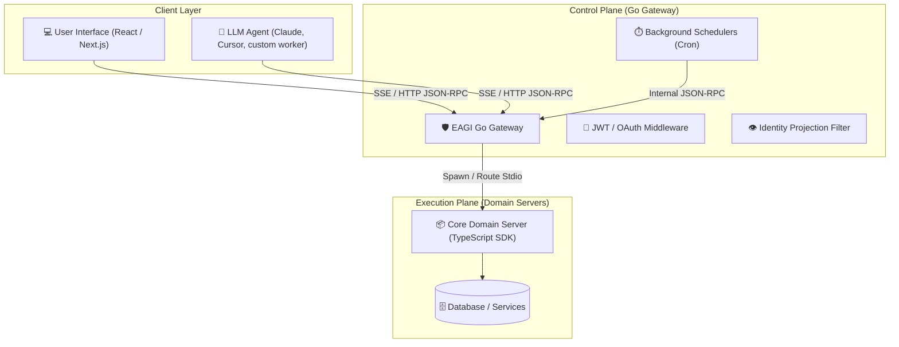

EAGI solves the **N × M integration problem** of the AI era. Instead of gluing every AI agent to every database or service manually, EAGI lets you build capabilities directly as native MCP **Tools, Resources, and Prompts**, and serve them securely to any frontend UI or autonomous LLM agent through a single, unified gateway.

## Why EAGI?

*   **MCP-First Architecture**: Build and deploy business capabilities directly on top of the Model Context Protocol, ensuring they are instantly consumable by AI agents (e.g. Cursor, Claude, custom workers) and standard web interfaces.
*   **Go-Based Control Plane**: A high-performance, stateless proxy gateway built in Go that handles session isolation, rate-limiting, and identity propagation with sub-millisecond overhead.
*   **Domain-Driven SDK**: Structure your backend logic into clean, self-contained TypeScript "Domain Servers" using a rich SDK that includes dependency injection, lifecycle hooks, and filter middleware.
*   **Enterprise Governance**: Enforce OIDC authentication, role-based access control (RBAC), cryptographically chained audit logging, and manual approval gates out of the box.

---

## Architecture Blueprint

---

## Core Comparison

| Feature | Standard MCP Setup | EAGI Framework |
| :--- | :--- | :--- |
| **Routing** | Local config file per client | Centralized gateway routing |
| **Security** | API keys in local config | Gateway OIDC / JWT propagation |
| **Session Isolation**| None (State leakage) | Session-scoped transaction remapping |
| **Scalability** | Monolithic process per host | Distributed multi-process domains |
| **Triggers** | Manually run scripts | Native cron-scheduled triggers |
