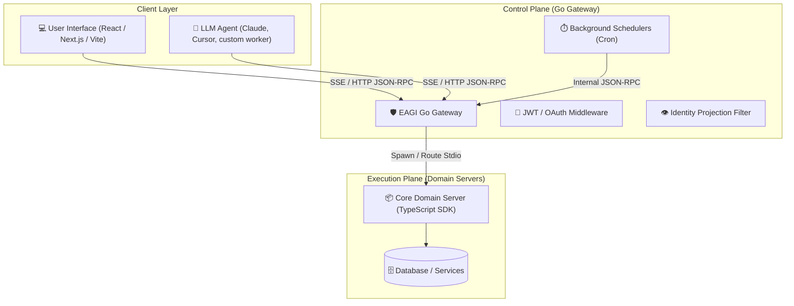

# MCP-Native Architecture & MCP-First Development

This document outlines the **MCP-Native** architectural pattern and the **MCP-First** development methodology using the EAGI framework. 

---

## The Paradigm Shift

Historically, software applications have been built **User-First** or **API-First**:
1. **User/API-First (Traditional)**: You build a database, wrap it in a REST or GraphQL API, build a web/mobile UI, and later wrap those REST APIs in tool schemas so an LLM agent can use them.
2. **MCP-Native (AI-Era)**: You build your core capabilities directly as Model Context Protocol (MCP) **Tools**, **Resources**, and **Prompts**. The frontend UI and the AI agent are simply two different clients consuming the same unified MCP gateway.

### MCP-First vs. MCP-Native
* **MCP-First** is a **development strategy**. You build and expose your core business logic as an MCP server before writing any UI or custom client integrations, ensuring your backend is "Agent-Ready" from day one.
* **MCP-Native** is the **systems architecture**. The application's core communication layer runs natively on the MCP protocol, using its JSON-RPC primitives for both human-facing UIs and autonomous agent operations.

---

## Architectural Blueprint



---

## Core Components of an MCP-Native App

An MCP-Native application built on EAGI is divided into four main layers:

1. **Domain Server (Business Logic)**: Written in TypeScript/Go. It declares all business functions as **Tools** and data streams as **Resources**.
2. **Go Gateway (Control Plane)**: Manages authentication, rate-limiting, and routes requests from different clients (UIs or Agents).
3. **UI Client (User Interface)**: A web frontend (React/Vite/Next.js) that interacts with the backend by calling MCP tools and reading resources over Server-Sent Events (SSE).
4. **Agent (Coprocessor)**: An LLM that connects to the same gateway session to execute actions or suggest updates directly on the user's behalf.

---

## Example App: "EAGI Tasks" (MCP-Native Workspace)

Below is a complete implementation blueprint for an MCP-Native Task Management application.

### 1. The Domain Server (Backend)

We configure the domain server in `eagi.config.ts` and define tasks as a **Resource** (for queries) and an update action as a **Tool** (for mutations).

#### [NEW] `domains/tasks/resource.ts` (Data Query)
Exposes the tasks list to both the UI and the Agent.

```typescript
import { defineResource } from '@eagi/sdk';

export default defineResource({
  uri: "tasks://active",
  name: "Active Tasks",
  description: "A real-time list of all active tasks in the user's workspace.",
  handler: async (context) => {
    const db = context.services.database;
    const userId = context.session.userId; // Injected by Go Gateway JWT auth
    
    const tasks = await db.query("SELECT * FROM tasks WHERE user_id = ? AND status = 'active'", [userId]);
    return {
      contents: [
        {
          uri: "tasks://active",
          mimeType: "application/json",
          text: JSON.stringify(tasks)
        }
      ]
    };
  }
});
```

#### [NEW] `domains/tasks/tools/create_task.ts` (Data Mutation)
Allows both the UI and the Agent to create tasks.

```typescript
import { defineTool } from '@eagi/sdk';
import { z } from 'zod';

export default defineTool({
  name: "create_task",
  description: "Creates a new task in the workspace.",
  input: z.object({
    title: z.string().min(1).describe("The title of the task"),
    dueDate: z.string().optional().describe("ISO date string for task deadline"),
    priority: z.enum(["low", "medium", "high"]).default("medium")
  }),
  handler: async (input, context) => {
    const db = context.services.database;
    const userId = context.session.userId;
    const { title, dueDate, priority } = input;

    const result = await db.execute(
      "INSERT INTO tasks (title, due_date, priority, user_id, status) VALUES (?, ?, ?, ?, 'active')",
      [title, dueDate || null, priority, userId]
    );

    return {
      success: true,
      taskId: result.insertId,
      message: `Task "${title}" created successfully.`
    };
  }
});
```

---

### 2. The Frontend UI (Client)

The frontend uses standard MCP client mechanisms to fetch data and trigger mutations. Instead of standard REST calls, the UI fires JSON-RPC calls over SSE.

#### `src/components/TaskList.tsx` (React Component)

```tsx
import React, { useEffect, useState } from 'react';
import { EventSourceClient } from '@modelcontextprotocol/sdk/client/sse.js';

export function TaskList() {
  const [tasks, setTasks] = useState([]);
  const [client, setClient] = useState<EventSourceClient | null>(null);

  useEffect(() => {
    // 1. Connect to the EAGI Go Gateway via Server-Sent Events (SSE)
    const mcpClient = new EventSourceClient(new URL("https://gateway.eagi.dev/sse"), {
      headers: {
        "Authorization": `Bearer ${localStorage.getItem("jwt_token")}` // Pass JWT for identity projection
      }
    });

    mcpClient.connect().then(() => {
      setClient(mcpClient);
      // 2. Fetch the active tasks resource
      mcpClient.readResource({ uri: "tasks://active" }).then((response) => {
        const data = JSON.parse(response.contents[0].text);
        setTasks(data);
      });
    });

    return () => { mcpClient.close(); };
  }, []);

  const handleAddTask = async (title: string) => {
    if (!client) return;

    // 3. Trigger mutation by calling the MCP Tool
    const result = await client.callTool({
      name: "create_task",
      arguments: { title, priority: "high" }
    });

    // Refresh task list
    const response = await client.readResource({ uri: "tasks://active" });
    setTasks(JSON.parse(response.contents[0].text));
  };

  return (
    <div>
      <h1>My Workspace</h1>
      <ul>
        {tasks.map((task: any) => (
          <li key={task.id}>{task.title} - <strong>{task.priority}</strong></li>
        ))}
      </ul>
      <button onClick={() => handleAddTask("Review Q3 roadmap")}>Add Task</button>
    </div>
  );
}
```

---

### 3. The LLM Agent (Coprocessor)

The agent connects to the same `/sse` gateway endpoint. Because it uses the same protocol, it sees the exact same capabilities:

* **Querying State**: When the user says *"What are my high priority tasks?"*, the agent reads `tasks://active` (obtaining the same list the UI shows).
* **Executing Actions**: When the user says *"Create a task to review Q3 roadmap tomorrow"*, the agent invokes the `create_task` tool with `title: "Review Q3 roadmap"` and the calculated date, immediately modifying the database. The UI updates in real-time.
